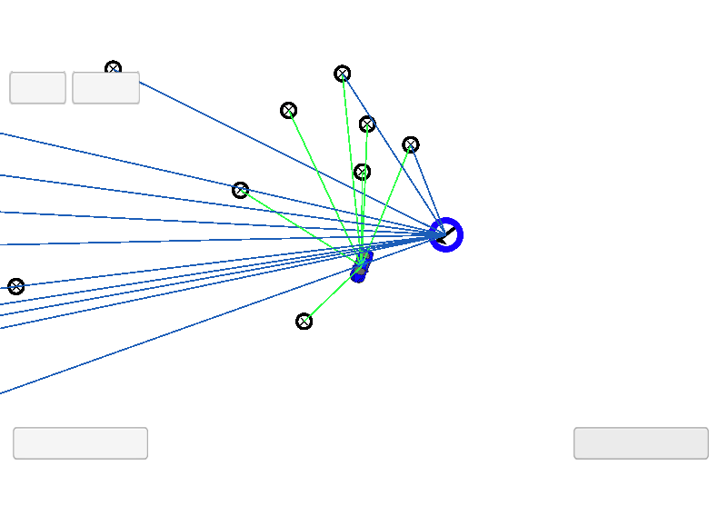
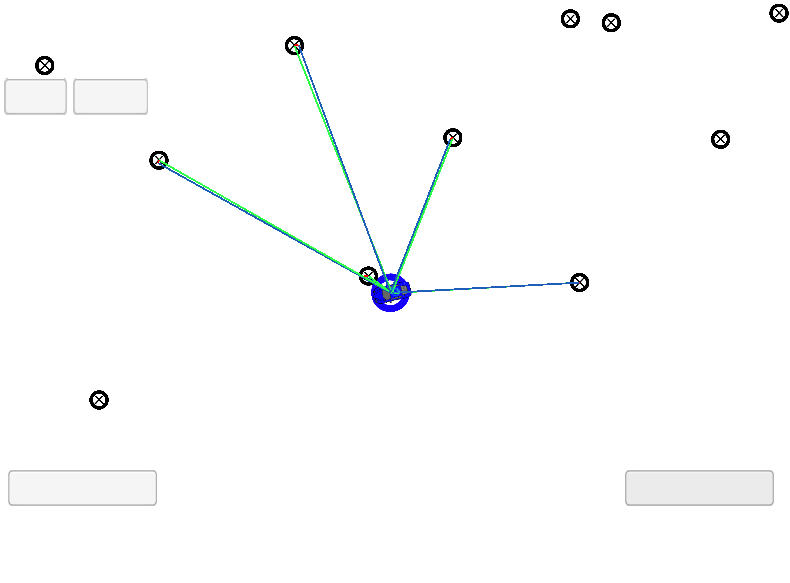

# Kidnapped Vehicle Project

This project was developed as part of the Udacity Self-Driving Car Engineer Nanodegree Program. The goal was to develop a 2 dimensional Particle Filter during a simulation and meet a success criteria for its accuracy.

---

## Overview

Your robot has been kidnapped and transported to a new location! Luckily it has a map of this location, a (noisy) GPS estimate of its initial location, and lots of (noisy) sensor and control data. The particle filter should use all this info to estimate `x` and `y` coordinates of the robot localization.

## Environment Setup

Instructions for setting up the environment can be found [here](setup.md). After compiling, run the executable and open the simulator on the particle filter project to check it out.

## Implementation

I actually started the project implementing the process inverted, by converting the landmarks to particle coordinates as I found it easier to understand. Even though I was able to compile and run the simulator, my best particle was not very accurate:



Imagining this could be a problem on the weight calculation as my 'meas' and 'mu' coordinates where both in particle coordinates, I changed everything back to map coordinates only to find that the problem persisted.

I went to the forums and found that a possible problem was the `default_random_engine` and that it was possible to achieve better results by changing it to `mt19937` a random number generation based on Mersenne Twister algorithm([link to forum topic](https://discussions.udacity.com/t/error-gets-large-weights-go-to-zero-problem-with-std-default-random-engine/452577)). The results did improve and the best particle looked more accurate, even though it was not enough to pass.

After hours studying the code, I found the problem... I was not using the distance calculation function provided in the `helper_functions.h` properly.

```
// The problem was that I was using the distance function like this:
double distance = dist(trans_observations[t].x,landmark_x,trans_observations[t].y,landmark_y);
// when it should have been like this:
double distance = dist(trans_observations[t].x,trans_observations[t].y,landmark_x,landmark_y);
```
After that my particle filter ran perfectly!



### Author

Diogo Loreto Leal, Self-Driving Car Engineer Nanodegree Student

